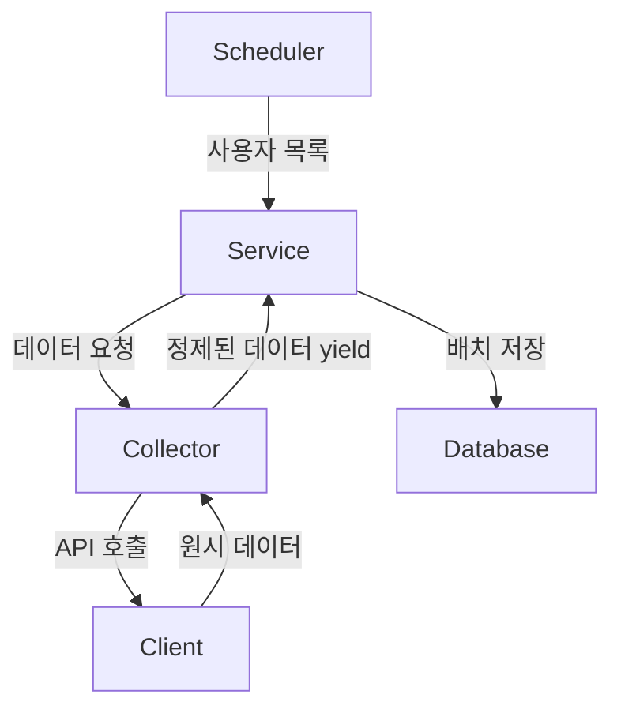

# GitHub Collector 앱 아키텍처 문서

## 개요

GitHub Collector는 GitHub API를 통해 사용자의 활동 데이터를 수집하고 관리하는 Django 앱입니다. 메모리 효율성을 위해 스트리밍 방식으로 데이터를 처리하며, 계층적 아키텍처를 통해 관심사를 분리합니다.

## 디렉토리 구조

```
github_collector/
├── README.md
├── api/
│   └── client.py              # API 연결 및 유틸리티
├── apps.py                    # Django 앱 설정
├── collectors/
│   ├── base.py               # Collector 베이스 클래스
│   └── repository.py          # 데이터 수집 로직
├── management/
│   └── commands/
│       └── test_repo_fetch.py # 테스트 커맨드
├── schedulers/
│   └── scheduler.py           # 스케줄링 로직
└── services/
    └── repository_service.py  # 비즈니스 로직
```

## 아키텍처 흐름



## 계층별 상세 설명

### 1. Scheduler 계층 (`schedulers/scheduler.py`)

**책임:**

- 데이터 수집 주기 관리
- 수집 대상 사용자 선정
- 작업 스케줄링 및 트리거

**주요 기능:**

```python
# 예시
- 일별/주별/월별 수집 주기 설정
- 활성 사용자 필터링
- 우선순위 기반 큐 관리
```

### 2. Service 계층 (`services/repository_service.py`)

**책임:**

- 비즈니스 로직 처리
- 데이터 검증 및 변환
- 배치 단위 DB 저장
- 트랜잭션 관리

**주요 기능:**

```python
# 예시
def batch_generator(generator: Generator[str, None, None], batch_size: int) -> Generator[List[str], None, None]:
    while True:
        batch = list(islice(generator, batch_size))
        if not batch:
            break
        yield batch

def save_repositories_in_batch(username: str, repo_gen: Generator[str, None, None], batch_size: int = 100):
    for batch in batch_generator(repo_gen, batch_size):
        #####  DB 비지니스 로직 #####
```

### 3. Collector 계층 (`collectors/`)

**책임:**

- GitHub API 호출 조정
- 데이터 수집 로직 구현
- 페이지네이션 처리
- 에러 핸들링

**구성:**

- `base.py`: 공통 수집 로직 및 인터페이스
- `repository.py`: 저장소 관련 데이터 수집
- TODO: 커밋, 이슈, pr 등등 추가 예정

**주요 기능:**

```python
# 예시
class RepositoryCollector(BaseCollector):
    def collect_repositories(self, username):
        """저장소 데이터를 스트리밍 방식으로 수집"""
        yield from self.client.get_user_repos(username)
        yield from self.client.get_contributed_repos(username)
```

### 4. API Client 계층 (`api/client.py`)

**책임:**

- HTTP 요청 처리
- 인증 및 헤더 관리
- Rate limiting 처리
- 페이지네이션 유틸리티

## 데이터 플로우

### 1. 스트리밍 처리

모든 데이터는 메모리 효율성을 위해 `yield`를 통해 스트리밍됩니다:

```
Scheduler → Service (단일 사용자)
         ↓
    Service → Collector (yield)
         ↓
    Collector → Client (yield)
         ↓
    Client → API (paginated)
```

### 2. 배치 처리

Service 계층에서 스트리밍된 데이터를 배치로 묶어 처리:

```python
# 메모리 효율적인 배치 처리
BATCH_SIZE = 100

for batch in chunked(streaming_data, BATCH_SIZE):
    process_and_save(batch)
```

## 주요 설계 원칙

### 1. 관심사의 분리 (Separation of Concerns)

- 각 계층은 명확한 책임을 가짐
- 계층 간 의존성 최소화

### 2. 메모리 효율성

- Generator를 통한 스트리밍 처리
- 대용량 데이터도 메모리 부담 없이 처리

### 3. 확장성

- 새로운 Collector 추가 용이
- Service 로직 독립적 확장 가능

### 4. 테스트 용이성

- 각 계층 독립적 테스트 가능
- Mock 객체를 통한 단위 테스트

## 사용 예시

### Management Command를 통한 테스트

```bash
python manage.py test_repo_fetch --username=byungKHee
```

### 프로그래밍 방식 사용

```python
from github_collector.services import RepositoryService

service = RepositoryService()
service.process_user_repositories('octocat')
```

## 성능 고려사항

1. **API Rate Limiting**

   - Client 계층에서 자동 처리
   - TODO: 재시도 로직 포함

2. **메모리 사용**

   - 스트리밍으로 일정한 메모리 사용량 유지
   - 배치 크기 조정 가능

3. **데이터베이스 부하**
   - 배치 삽입으로 DB 부하 감소
   - 트랜잭션 단위 최적화
